# Updating the master branch readme. THis is updated from amster branch and testing if it shows current version

<a href="https://www.microchip.com">
    <picture>
        <source media="(prefers-color-scheme: light)" srcset="images/microchip-light.png">
        <source media="(prefers-color-scheme: dark)" srcset="images/microchip-dark.png">
        
    </picture>
</a>

# Fine-tune Signal Amplification with Integrated Analog featuring Ultrasonic Range Detection - Use Case for the PIC18F56Q71 Microcontroller with MCC Melody

This application note describes how an ultrasonic range detector can be built using the Core Independent Peripherals (CIP) available on the PIC18-Q71 device family. The featured peripherals on this device family enable the ultrasonic range detection circuit to measure and compute the distance traveled by the ultrasonic signal while using minimal resources from the Central Processing Unit (CPU).

The focus of the application is to make use of two ultrasonic transducers: one as a transmitter and the other as a receiver. The transmitter emits an ultrasonic signal, while the receiver captures the reflected pulse. Two alternating Pulse-Width Modulation (PWM) signals drive the transmitter to create the required sent pulse, while a Peak Detector and Comparator are used to acquire the reflected signal. Meanwhile, a Universal Timer (UTMR) is employed to measure the time taken for the ultrasonic sonic signal to reach its target and then the distance is calculated based on the speed of sound.

The accuracy and precision of the measurements are dependent upon the shape and structure of the target object. Objects that are flat, large, or parallel to the ultrasonic transducers yield the most accurate responses, while small, curved, or tilted objects will provide a weak echo response due to wave scattering. Furthermore, environmental conditions such as temperature and humidity or airborne debris such as rain, snow, or dust may also alter the measurements taken.

<picture>
    
</picture>

## Related Documentation

- [PIC18-Q71 Product Family](https://www.microchip.com/en-us/products/microcontrollers-and-microprocessors/8-bit-mcus/pic-mcus/pic18-q71)
- [PIC18F56Q71 Product Page](https://www.microchip.com/en-us/product/PIC18F56Q71)
- [PIC18F56Q71 Data Sheet](https://ww1.microchip.com/downloads/aemDocuments/documents/MCU08/ProductDocuments/DataSheets/PIC18F26-46-56Q71-Microcontroller-Data-Sheet-DS40002329.pdf)
- [PIC18F56Q71 Curiosity Nano](https://www.microchip.com/en-us/development-tool/EV01G21A)
- [PIC18F56Q71 Code Examples on GitHub](https://github.com/orgs/microchip-pic-avr-examples/repositories?q=pic18f56q71&type=all)

## Software Used

- [MPLAB® X IDE v6.15 or newer](http://www.microchip.com/mplab/mplab-x-ide)
- [MPLAB XC8 2.45 or newer](http://www.microchip.com/mplab/compilers)
- [MPLAB Code Configurator Melody](https://www.microchip.com/en-us/tools-resources/configure/mplab-code-configurator/melody)
- [PIC18F-Q_DFP Device Family Pack v1.22.413 or newer](https://packs.download.microchip.com/)

## Hardware Used

- The [PIC18F56Q71 Curiosity Nano](https://www.microchip.com/en-us/development-tool/EV01G21A) Development board is used as a test platform:

    <picture>
        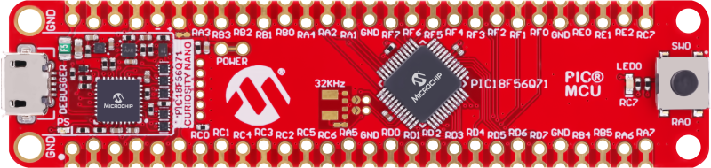
    </picture>

- Microchip [Curiosity Nano Base for Click boards™](https://www.microchip.com/en-us/development-tool/ac164162)

    <picture>
        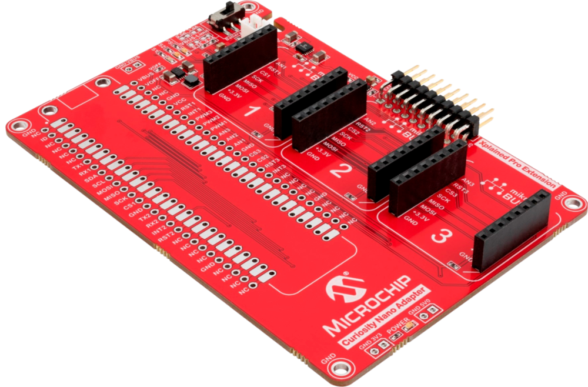
    </picture>

- MikroElektronika [PROTO Click](https://www.mikroe.com/proto-click) accessory board

    <picture>
        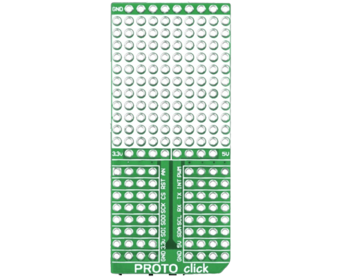
    </picture>

- 2× Ultrasonic Transducers

- 2× 10nF Capacitor

## Operation

To program the Curiosity Nano board with this MPLAB X project, follow the steps provided in the [How to Program the Curiosity Nano Board](#how-to-program-the-curiosity-nano-board) chapter.

## Working Principle

The ultrasonic range detector operates on a working principle similar to echolocation and can detect the presence of an object while measuring the distance to it without making physical contact. The entire process is based on the piezoelectric effect, with the ultrasonic sensor representing a piezoelectric transducer. This type of device is capable of converting electrical signals into mechanical vibrations and vice versa. The distance measurement is accomplished by generating and emitting ultrasonic pulses, which are then reflected back to the sensor by some object that is within the field of view of the sensor. The effective range in air can vary from a few centimeters to several meters, depending on the sensor and object's characteristics, as well as environmental conditions. 

The procedure of ultrasonic range detection is a time-of-flight (ToF) measurement based on the sound’s propagation time through a particular medium, typically air. The transducer can obtain the time delta between the transmitted ultrasonic signal and its corresponding received echo. The acquired time for the round trip is then used to compute the distance between the sensor and the object considering that the speed of sound is known beforehand. It should also be noted that the velocity of sound through air varies with temperature. For example, the speed of sound is 343 m/s in dry air at 20°C (68°F).

Within the field of transducer topologies, when considering short-range requirements, two main options exist: monostatic and bistatic configurations. In the monostatic topology, a single transducer serves the dual role of transmitting an impulse and receiving returning echoes. However, the monostatic transducer topology does come with certain limitations, such as the excitation ringing-decay phenomenon, inherent to the sensor. This leads to the creation of a blind zone, effectively imposing a constraint on the minimum detection range. To mitigate this issue, a damping resistor can be incorporated into the monostatic setup, effectively reducing the blind zone. This application note will focus on the bistatic topology as an alternative to eliminate the ringing decay. In this configuration, two separate transducers are utilized, one dedicated to transmission and the other for reception. The following figure provides an explanatory diagram illustrating this bistatic setup.

<picture>
  <source media="(prefers-color-scheme: light)" srcset="images/echo-light.png">
  <source media="(prefers-color-scheme: dark)" srcset="images/echo-dark.png">
  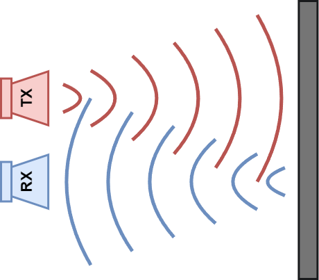
</picture>

An inherent issue associated with ultrasonic transducers is their tendency to continue oscillating (ringing) even after the drive signal is removed. This post-drive ringing is a consequence of the transducer's resonant mechanical behavior. When the transducer is driven, it is tuned to ring at its designated ultrasonic frequency. Subsequently, it requires a brief period to dampen out the oscillations after the drive ceases. During the ringing phase, the transmitted signal can couple through the PCB or travel through the air between the transmitter and the receiver. To ensure that only the reflected pulse signal is received, and any other interfering signals are avoided, a delay is necessary before activating the receiver. This delay allows sufficient time for the ringing to dampen out completely. Therefore, the minimum detectable distance of the receiver is directly influenced by the time it takes for the ringing to dampen out.

<picture>
  <source media="(prefers-color-scheme: light)" srcset="images/system-light.png">
  <source media="(prefers-color-scheme: dark)" srcset="images/system-dark.png">
  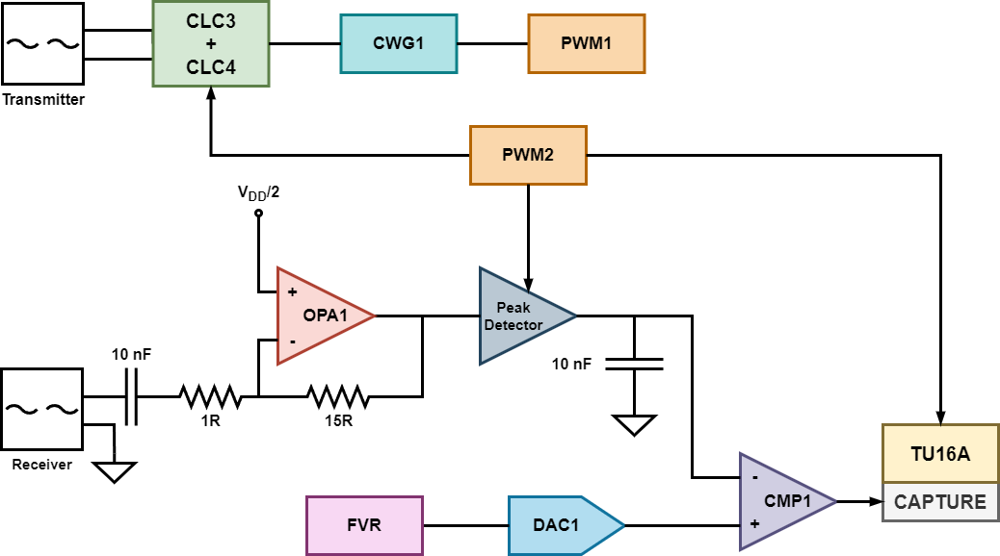
</picture>

In the current implementation, a bistatic topology was chosen. Consequently, to sum up all the presented aspects of an ultrasonic range detector system, the main operation principles of this type of configuration are to be described. At first, two alternating fixed 40 kHz PWM signals are generated to drive the transducer periodically, thus creating the desired ultrasonic pulse. After the transmitter sensor produces a pulse, the system starts a timer and implements a hardware delay to avoid post-drive ringing, waiting for the oscillation to dampen out completely. When the echo is received by the other transducer and its amplitude value meets the threshold requirements, the timer stops, effectively acquiring the time needed for the round trip. Finally, the distance between the sensor and the target object is computed using the known speed of sound and the obtained time measurement. It should also be noted that if no echo is received, the system ignores the current measurement and moves on to the next one.

## Software Architecture

This project implements a hierarchical approach from the software point of view. The main function represents the entry point for the code and calls the application’s principal function, `Application_Run`, which handles the system’s initialization and includes the main application loop.

At first, the system clock, pins and peripherals are initialized using the application programming interface (API) provided by the MCC by effectively calling the `SYSTEM_Initialize` function. Therefore the PWM, CWG, CLC, OPA, FVR, DAC, CMP, UTMR and UART peripherals, along with the system clock and pins are configured just by using the generated code provided by the MCC with no further intervention necessary. Further on, the ISR callbacks needed for the distance measurements’ acquisition are registered by the `InitializeCallbacks` function. The CMP1’s callback (`CaptureCounterCallback`) captures the UTMR’s counter value when a reflected echo is detected, disables the CMP1 interrupt to avoid detecting a false echo and signals to the main context that a new data point is available. On the other hand, the PWM2 callback (`ResetComparatorInterruptCallback`) clears the CMP1 interrupt flag and re-enables its interrupt to adjust it for a new acquisition. Furthermore, the function also enables global interrupts.

After the initialization step ends, the main application loop starts running. This code continuously checks if a new data point is available and, if applicable, it also verifies that it’s within valid bounds (selected empirically with regards to the physical limits of the ultrasonic transducer). If the counter value falls within those constraints, it’s added to a moving average and the current mean distance is printed on the console. The moving average, also called rolling or running average, is a type of Finite Impulse Response (FIR) low-pass filter effectively attenuating high-frequency variations from the input. To make the implementation of the filter’s algorithm reasonably fast, the output of the moving average is not computed using a weighted sum of coefficients and values, instead it uses internally what is called a ring or circular buffer. Essentially, the static allocated circular buffer behaves like a queue of N elements and the system keeps track of the sum of the current queue configuration. When a new sample is available, the buffer’s front element is subtracted from the sum and the new data point is pushed on to the queue and added to the sum, thus a new average can be computed.

 

<picture>
    <source media="(prefers-color-scheme: light)" srcset="images/flow-light.png">
    <source media="(prefers-color-scheme: dark)" srcset="images/flow-dark.png">
    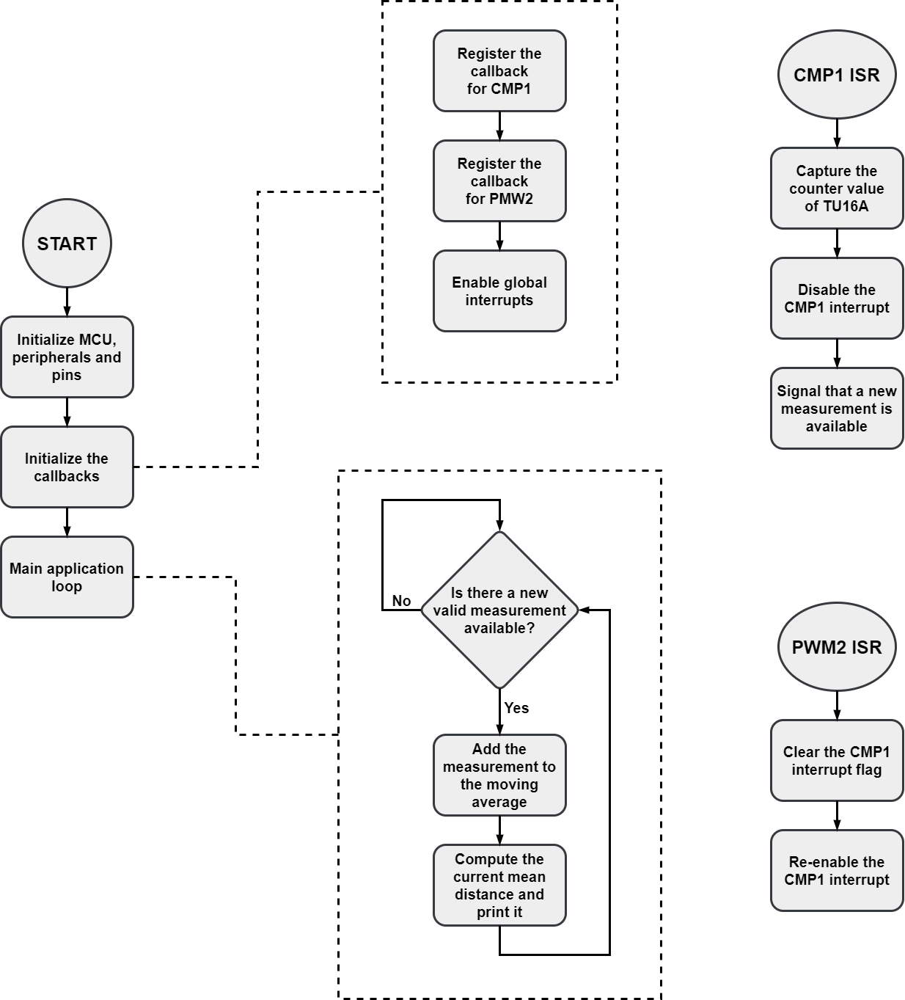
</picture>

## Setup

- **Clock Control**
  - Clock Source: HFINTOSC
  - HF Internal Clock: 64 MHz
  - Clock Divider: 1

<picture>
  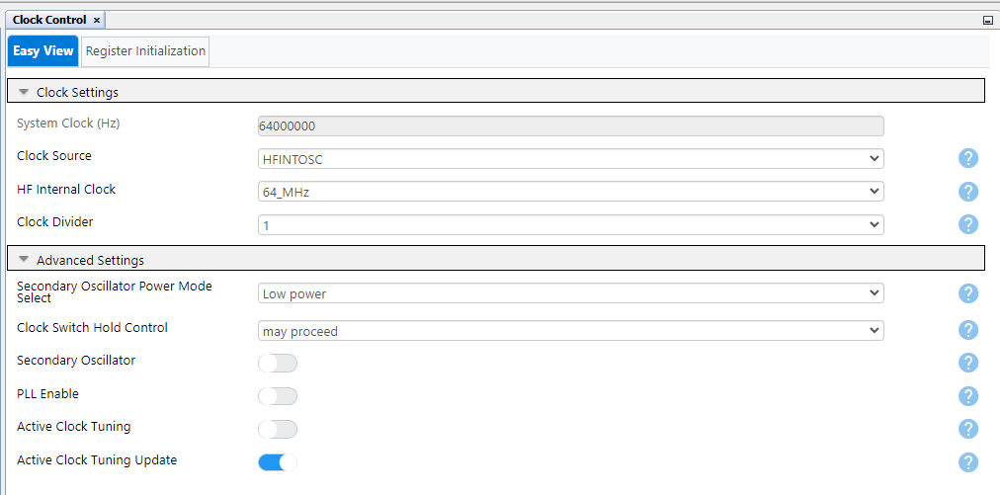
</picture>

***

- **Configuration Bits**
  - Watchdog Timer: Disabled
  - Default values for the rest of the bits

<picture>
  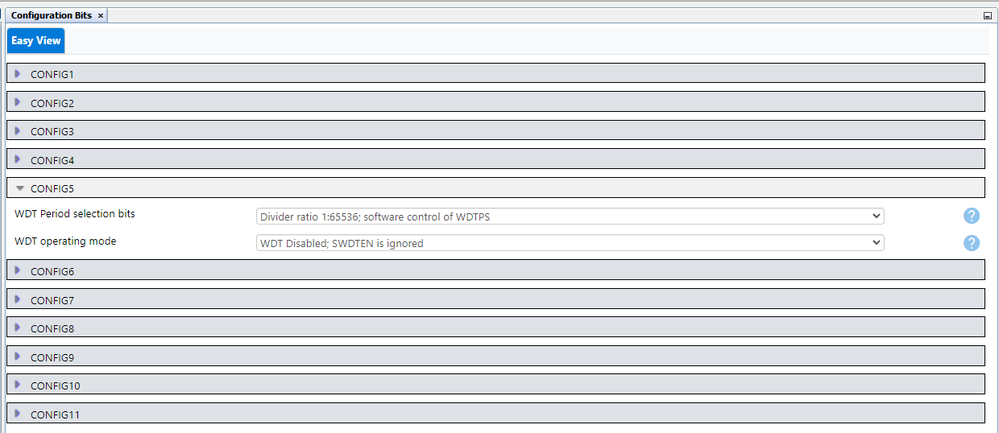
</picture>

***

- **PWM1**
  - Clock Source: HFINTOSC
  - Prescaler: Disabled
  - Mode: Left-aligned
  - Frequency: 40 kHz
  - Output 1 - Duty Cycle: 50%
  - Custom Name: `PWM_DRIVE`

<picture>
  
</picture>

***

- **PWM2**
  - Clock Source: LFINTOSC
  - Prescaler: Disabled
  - Mode: Left-aligned
  - Frequency: 50 Hz
  - Output 1 - Duty Cycle: 1.5%
  - Output 2 - Duty Cycle: 2%
  - Output 2 - Inverse Polarity: Enabled
  - Interrupt: Enabled
  - Period Interrupt: Enabled
  - Custom Name: `PWM_CONTROL`

<picture>
  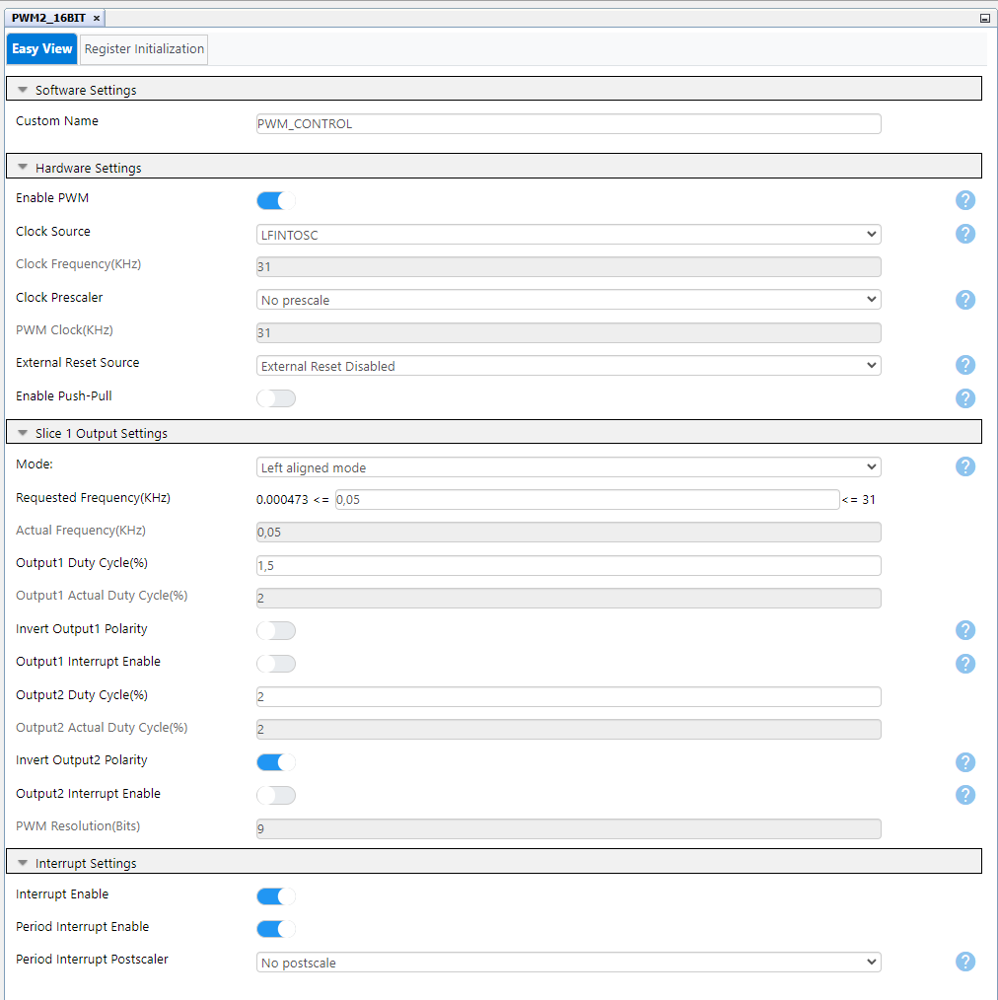
</picture>

***

- **CWG1**
  - Enabled
  - PWM Dependency: PWM1
  - Input Source: PWM1 Output 1
  - Output Mode: Half-Bridge
  - Clock Source: HFINTOSC
  - Custom Name: `CWG`

<picture>
  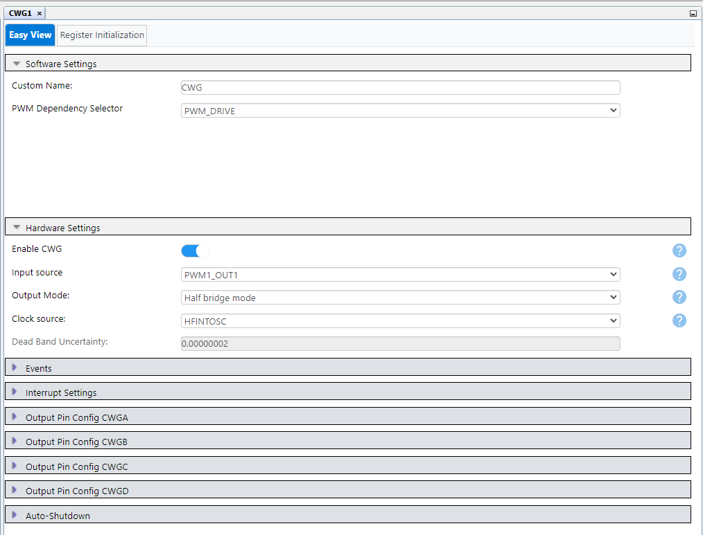
</picture>

***

- **CLC3**
  - Enabled
  - Logic Cell Mode: AND-OR
  - Input 1: CWG1A Output -> OR Gate 1
  - Input 2: PWM2 Output 1 -> OR Gate 2
  - Custom Name: `CLC_DRIVE1`

<picture>
  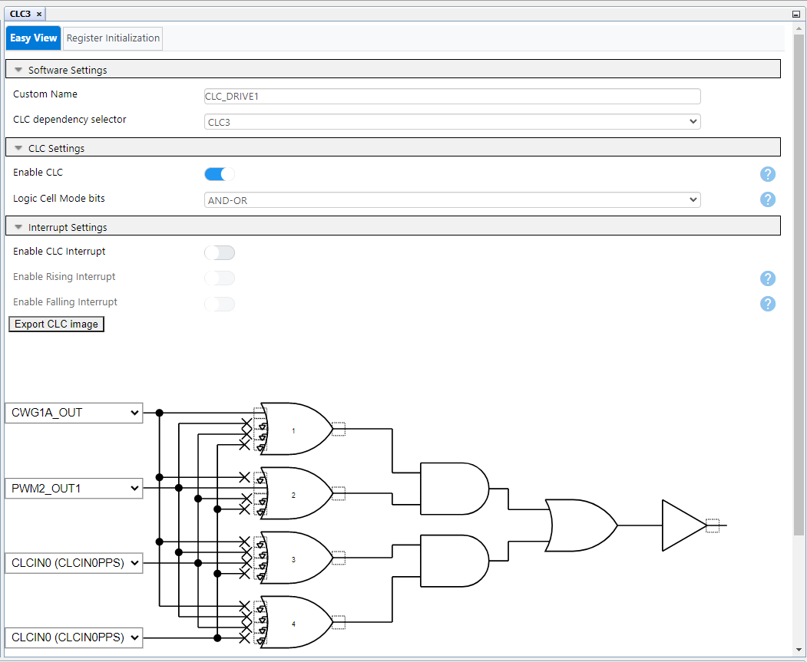
</picture>

***

- **CLC4**
  - Enabled
  - Logic Cell Mode: AND-OR
  - Input 1: CWG1B Output -> OR Gate 1
  - Input 2: PWM2 Output 2 -> OR Gate 2
  - Custom Name: `CLC_DRIVE2`

<picture>
  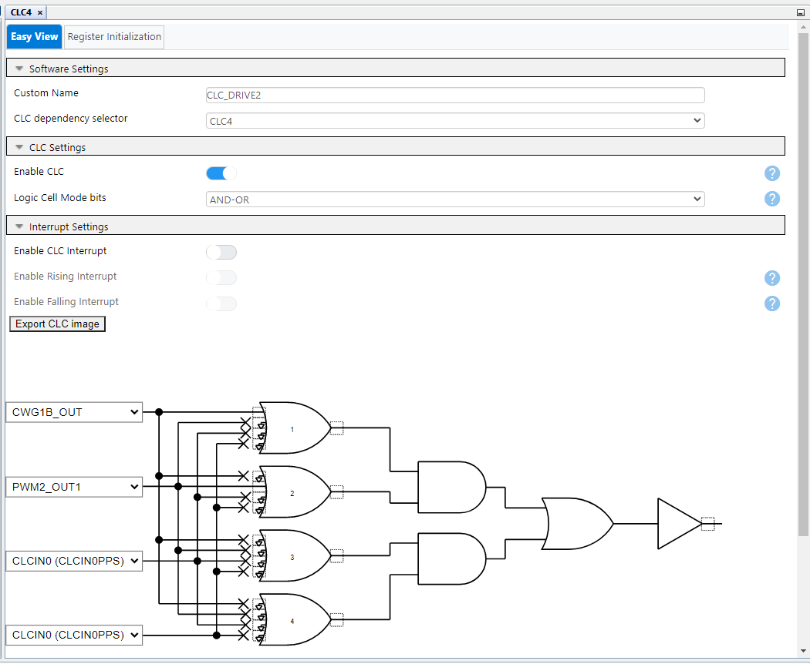
</picture>

***

- **OPA1**
  - Enabled
  - Configuration: Inverting Programmable Gain Amplifier
  - Positive Channel: VDD/2
  - Positive Source: OPA1IN0+
  - Negative Channel: GSEL
  - Negative Source: OPA1IN2-
  - Internal Resistor Ladder: R1 = 1R and R2 = 15R => R2/R1 = 15 => Gain ≈ 15
  - Feedback Mode: OPA1OUT
  - Hardware Override: Enabled
  - Hardware Override Source: PWM2 Output 2
  - Override Control High: Peak Detect configuration with User Defined Feedback
  - Override Control Low: Peak Detect configuration with Unity Gain Feedback
  - Custom Name: `OPAMP`

<picture>
  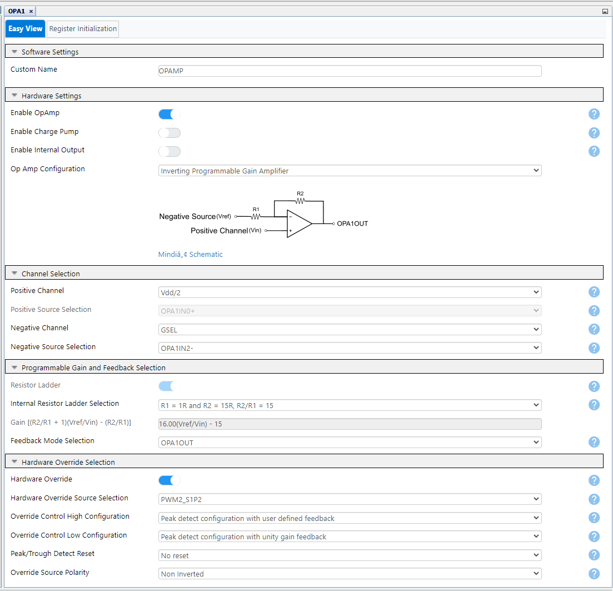
</picture>

***

- **FVR**
  - Enabled
  - FVR Buffer Gain to Other Peripherals: 2×
  - Custom Name: `FVR`

<picture>
  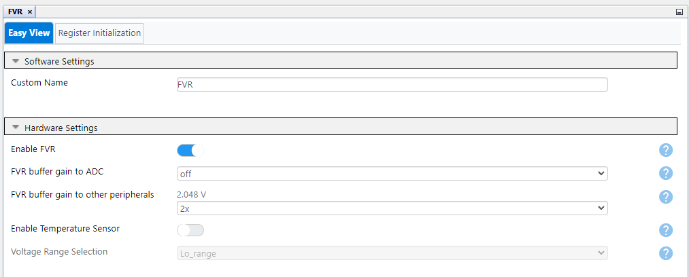
</picture>

***

- **DAC1**
  - Enabled
  - Output Value: 1.666V
  - Positive Reference: FVR
  - Negative Reference: VSS
  - Output Enable: DACOUT1 and DACOUT2 are Disabled
  - Custom Name: `DAC`

<picture>
  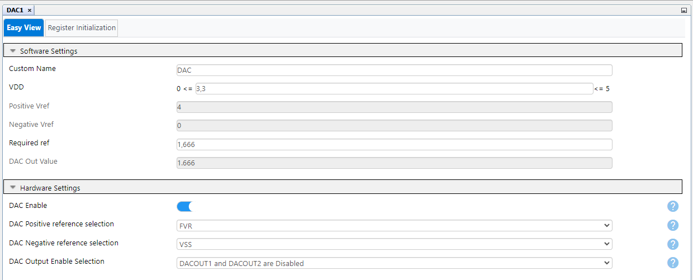
</picture>

***

- **CMP1**
  - Enabled
  - Positive Input: DAC1 Output
  - DAC Dependency: DAC1
  - Negative Input: C1IN3-
  - Output Polarity: Not Inverted
  - Comparator Speed: 30 ns (High Speed)
  - Interrupt: Enabled
  - Rising Edge Interrupt: Disabled
  - Falling Edge Interrupt: Enabled
  - Custom Name: `CMP`

<picture>
  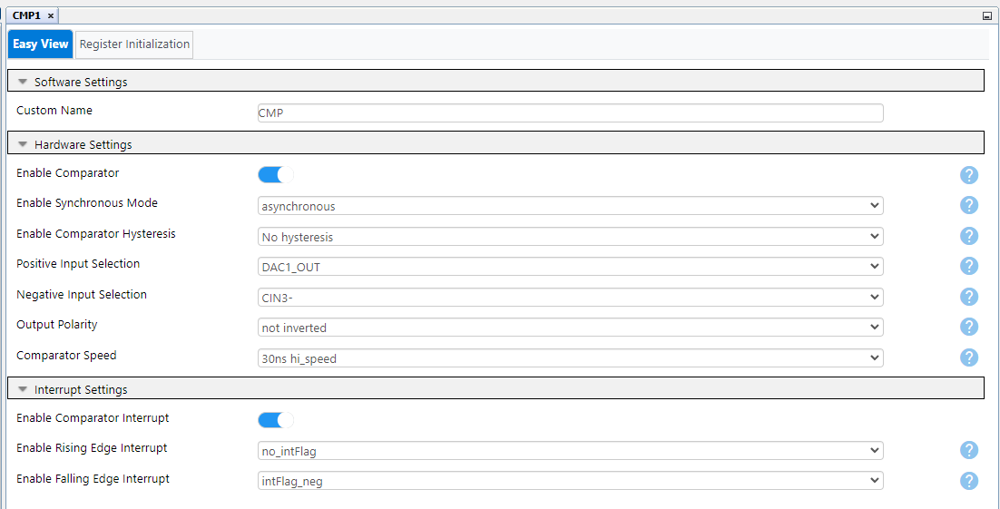
</picture>

***

- **UTMR**
  - Timer Dependency: TU16A
  - Enabled
  - Clock Source: HFINTOSC
  - Prescaler: 20
  - Clock Polarity: Rising Edge
  - Synchronization: Disabled
  - Period: 21.5 ms
  - Start Condition: Rising ERS Edge
  - Stop Condition: At PR Match
  - Reset Condition: ERS Level = 0 or PR Match
  - ERS Source: PWM2 Output 1
  - ERS Polarity: Inverted
  - Custom Name: `COUNTER`

<picture>
  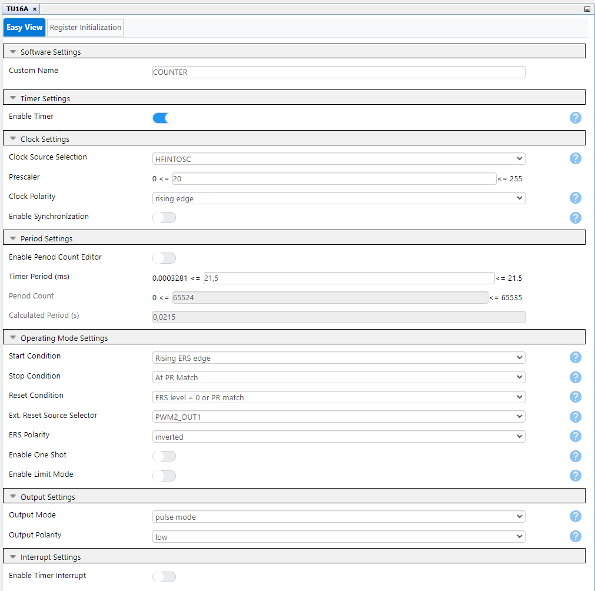
</picture>

***

- **UART**
  - UART PLIB: UART2
  - Baud Rate: 115200
  - Parity: None
  - Data Size: 8
  - Stop Bits: 1
  - Redirect `printf` to UART: Enabled
  - Custom Name: `UART`

<picture>
  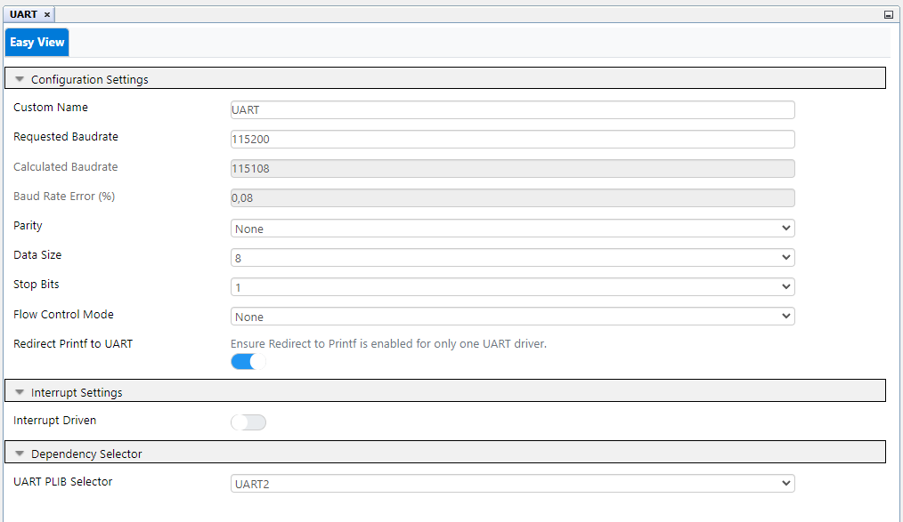
</picture>

***

- **GPIO**
  - RA1 (`OPAMP_OUT`) - Analog Output (OPA1OUT)
  - RA5 (`RECEIVE`) - Analog Input (OPA1IN1-)
  - RB1 (`CMP_IN`) - Analog Input (CMP1IN2-)
  - RB4 (`UART_TX`) - Digital Output (UART2TX)
  - RB3 (`DRIVE1`) - Analog Output (CLC3OUT)
  - RB0 (`DRIVE2`) - Analog Output (CLC4OUT)

<picture>
  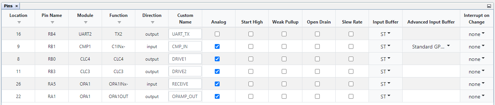
</picture>

<picture>
  
</picture>

## Demo

The 40 kHz signal that is needed to drive the ultrasonic transducer is generated by the PWM1 peripheral and can be observed in the figure below in gray (PWM_DRIVE). The logic analyzer capture also shows the PWM2’s control signal in brown (PWM_CONTROL), that determines the measurement acquisition interval and number of pulses, the two resulting 180 degrees out-of-phase drive signals in red and orange (DRIVE1 and DRIVE2) and the inverted polarity PWM2’s delay signal in yellow (PWM_TIMER), which implements the hardware delay that avoids post-drive ringing.

<picture>
  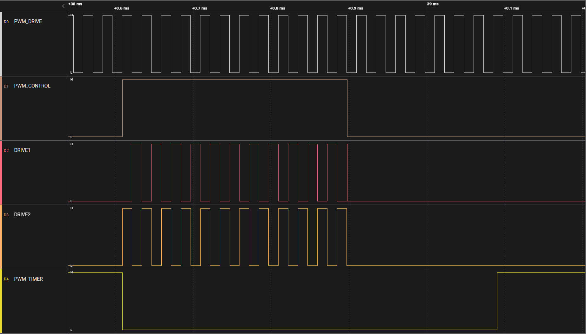
</picture>

The following figure highlights a received amplified ultrasonic echo in gray (OPAMP_OUT) along with the two PWM2 signals. The hardware delay between the falling edge of the PWM_CONTROL (that starts the UTMR’s counting) and the rising edge of the PWM_TIMER (that enables the OPAMP’s amplification) can easily be observed.

<picture>
  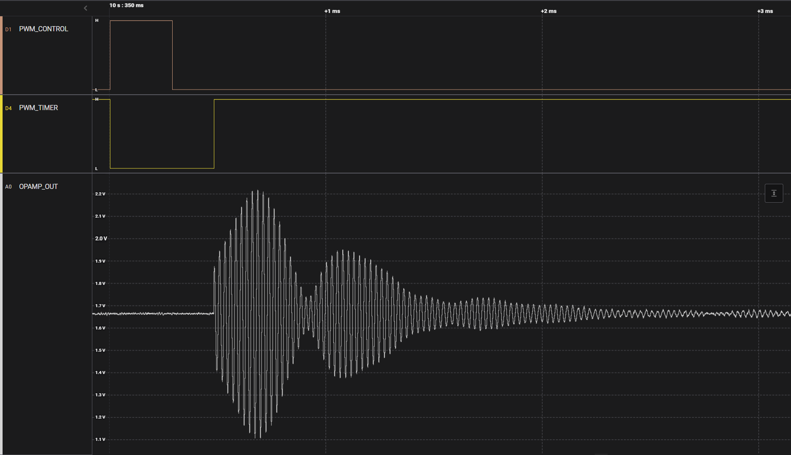
</picture>

The last figure illustrates the same scenario with the same signals, but with the OPAMP’s peak detector enabled. Observe the small peak at the end of the main signal’s amplitude. This would have been detected as a new echo signal by the comparator if its interrupts had not been disabled after the first acquisition in the current measurement window.

<picture>
  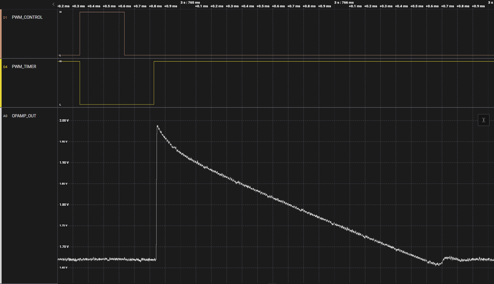
</picture>

## Summary

This application demonstrates the capabilities of the Core Independent Peripherals of the PIC18-Q71 device family by using them in an ultrasonic range detector system. The featured peripherals on this family of devices enable the circuit to measure and compute the distance travelled by the ultrasonic signal while using minimal resources from the Central Processing Unit. The project uses a minimum number of easy to find external components, two ultrasonic transducers and two capacitors for lower production costs. The solution for an ultrasonic range detector can help technology enthusiasts and may be used in other applications like proximity sensors, anti-collisions safety systems, or robotic obstacle detection.

## How to Program the Curiosity Nano board

This chapter shows how to use the MPLAB X IDE to program a PIC® device with an *ExampleProject.X*. This can be applied for any other projects.

1. Connect the board to the Computer.

2. Open the *ExampleProject.X* project in MPLAB X IDE.

3. Set the **ExampleProject** project as main project.

    Right click on the project in the **Projects** tab and click **Set as Main Project**.

    

4. Clean and build the **ExampleProject** project.

    Right click on the **ExampleProject** project and select **Clean and Build**.

    

5. Select the **PIC Curiosity Nano** in the Connected Hardware Tool section of the project settings:

    - Right click on the project and click **Properties**
    - Click on the arrow under the Connected Hardware Tool
    - Select the **PIC Curiosity Nano**, click **Apply** and then **OK**:

    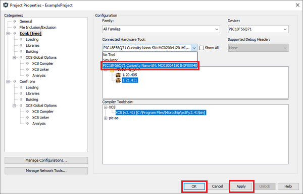

6. Program the project to the board.

    Right click on the project and select **Make and Program Device**.

    

## Contents

- [Back to Related Documentation](#related-documentation)
- [Back to Software Used](#software-used)
- [Back to Hardware Used](#hardware-used)
- [Back to Operation](#operation)
- [Back to Working Principle](#working-principle)
- [Back to Software Architecture](#software-architecture)
- [Back to Setup](#setup)
- [Back to Summary](#summary)
- [Back to How to Program the Curiosity Nano board](#how-to-program-the-curiosity-nano-board)
- [Back to Top](#fine-tune-signal-amplification-with-integrated-analog-featuring-ultrasonic-range-detection---use-case-for-the-pic18f56q71-microcontroller-with-mcc-melody)
